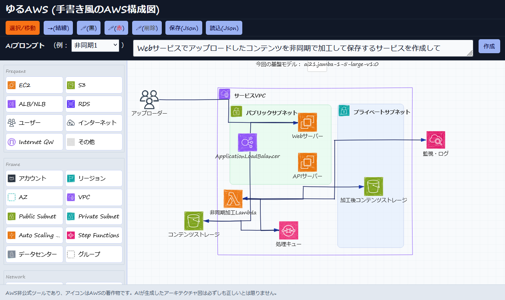

# Yuru AWS - AI-Powered Hand-drawn AWS Architecture Diagram Tool

Handwritten-style AWS architecture diagram (generated by AI)

手書き風のAWSアーキテクチャ図を簡単に作成できるWebアプリケーションです。AIによる自動生成機能と直感的な操作で、美しい構成図を素早く作成できます。

## Screenshots



<!-- Add more screenshots here -->
<!--  -->
<!--  -->

## 主要機能

- **アイコン配置**: ドラッグ&ドロップでAWSサービスアイコンを配置
- **AI自動生成**: プロンプトからAWS構成図を自動生成
- **手描き風スタイル**: クレヨンで描いたようなアイコンや、直線ではない線
- **豊富なAWSサービス**: よく使われるAWSサービスアイコンをピックアップ
- **直感的操作**: ドラッグ&ドロップ、範囲選択
- **編集機能**: ノード/フレーム/エッジの追加・削除・移動・リサイズ
- **データ入出力**: JSONによる構成図の保存・読み込み
- **手描きツール**: ペンツールによる自由描画

## インストール方法

### 1. リポジトリのクローン
```bash
git clone https://github.com/hayayu0/yuru-aws.git
cd yuru-aws
```

### 2. 依存関係のインストール
```bash
npm install
```

### 3. 設定ファイルの準備
```bash
cp public/config-example.json public/config.json
```

`public/config.json` の AI_PROMPT_ENDPOINT の値を編集してAIエンドポイントを設定してください：
```json
{
  "AI_PROMPT_ENDPOINT": "YOUR_AI_ENDPOINT_URL_HERE"
}
```

### 4. 開発サーバーの起動
```bash
npm run dev
```

ブラウザで `http://localhost:5173` にアクセスしてください。

## 使い方

1. **アイコン配置**: 左側のパレットからAWSサービスアイコンをキャンバスにドラッグ&ドロップ
2. **接続線の描画**: アイコン間をクリックして接続線を描画
3. **AI生成**: 上部のAIバーにプロンプトを入力して構成図を自動生成
4. **保存・読み込み**: JSONファイルで構成図を保存・読み込み
5. **手描き**: ペンツールで自由に描画

## 技術スタック

- **React 18** + **TypeScript**
- **Vite** (ビルドツール)
- **Rough.js** (手描き風描画)
- **ESLint** + **Prettier** (コード品質)

## ビルド

```bash
npm run build
```

## ライセンス

MIT License

## 貢献

Issueの報告を歓迎します
